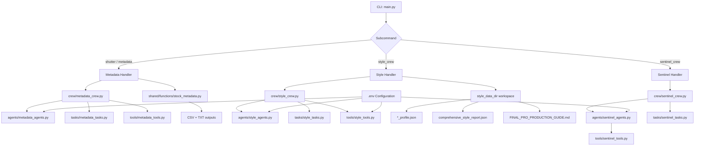

# Home Sentinel

Home Sentinel is a multi-team CrewAI project for:

- stock metadata generation (Shutterstock-oriented)
- photography style analysis and production guidance
- home-network security scanning and recommendations

The project is organized around independent teams (crews) and a single CLI entrypoint.

## What This Project Does

### 1) Metadata Team (`metadata`, alias `shutter`)

Runs a batch pipeline over image files and outputs both CSV and TXT metadata summaries.

Execution model:

- all images are submitted in a single CrewAI batch invocation (`kickoff_for_each`)
- results are then persisted per image into CSV/TXT outputs

Pipeline stages:

1. Visual analysis from image content (Ollama vision tool)
2. Commercial metadata generation (title + keywords)
3. Optional Gemini formatting/audit stage when `--crew shutter_crew_gemini` is selected

Main outputs:

- `shutterstock_upload.csv`
- `shutterstock_upload.txt`

### 2) Style Team (`style_crew`)

Analyzes author photo folders and produces:

1. Per-author profile JSON files
2. A consolidated style report JSON
3. A final production guide in Markdown

All style artifacts are generated in a configurable workspace (`--style-data-dir`).

### 3) Sentinel Team (`sentinel_crew`)

Scans a subnet, analyzes potential risks, and produces actionable suggestions.

## Project Structure

- `main.py`: CLI entrypoint and command dispatch
- `crew/`: crew composition and task wiring
- `agents/`: agent definitions and LLM bindings
- `tasks/`: task descriptions/outputs
- `tools/`: custom tools used by agents
- `shared/`: reusable utilities and shared classes

Important files:

- `main.py`
- `crew/metadata_crew.py`
- `crew/style_crew.py`
- `crew/sentinel_crew.py`
- `shared/functions/stock_metadata.py`
- `shared/classes/final_stock_metadata.py`

## Runtime Requirements

- Python 3.10+
- Ollama running and reachable (for local models/tools)
- Optional Gemini API key for Gemini-based flows

Install dependencies:

```bash
pip install -r requirements.txt
```

## Environment Configuration

Create a `.env` file in project root.

Core variables:

- `OLLAMA_BASE_URL` (example: `http://localhost:11434`)
- `VISION_MODEL`
- `LOCAL_MODEL`
- `LOCAL_MODEL_PLUS`
- `PHOTO_INFO` (optional metadata hint string)

Gemini variables (optional, required only for Gemini flows):

- `GEMINI_API_KEY`
- `GEMINI_MODEL`

### Style Team Model Routing

Style team is provider-configurable and does not hardcode ChatGPT models.

Agent-level routing:

- `STYLE_AGENT_PROVIDER=ollama|gemini`
- `STYLE_AGENT_MODEL` (optional override)

Tool-level deep analysis routing:

- `STYLE_LLM_PROVIDER=ollama|gemini`
- `STYLE_LLM_MODEL` (optional override)

Fallback behavior:

- if provider is `ollama`, style uses `STYLE_*_MODEL` override or `LOCAL_MODEL`/`VISION_MODEL`
- if provider is `gemini`, style requires `GEMINI_API_KEY` and model (`STYLE_*_MODEL` or `GEMINI_MODEL`)

## CLI Usage

Show help:

```bash
python main.py --help
```

### Metadata batch

```bash
python main.py metadata --target-folder ./images
```

Legacy alias:

```bash
python main.py shutter --target-folder ./images
```

Legacy crew mode with explicit crew selection:

```bash
python main.py --crew shutter_crew_gemini --target-folder ./images
```

### Style analysis

```bash
python main.py style_crew --root-directory ./authors --style-data-dir ./styleData
```

### Sentinel scan

```bash
python main.py sentinel_crew --subnet 192.168.1.0/24
```

## Supported Inputs and Outputs

### Metadata team

Input image extensions:

- `.jpg`
- `.jpeg`
- `.png`

Output fields include:

- description
- title
- keywords
- status
- modifications

### Style team

Input image extensions:

- `.jpg`
- `.jpeg`
- `.png`

Output artifacts in selected style workspace:

- `*_profile.json`
- `comprehensive_style_report.json`
- `FINAL_PRO_PRODUCTION_GUIDE.md`

## Architecture Notes

### High-Level Flow Diagram



### Command dispatch design

`main.py` uses a command handler registry (`COMMAND_HANDLERS`) to map subcommands to dedicated handler functions.

Benefits:

- adding a new team does not require growing `if/elif` chains
- each command flow is isolated and easier to test

Legacy compatibility:

- `metadata` is the canonical command
- `shutter` is a CLI alias for `metadata`
- `--crew shutter_crew` and `--crew shutter_crew_gemini` are still supported through a dedicated legacy parser path for backward compatibility

### Shared metadata pipeline

Batch processing logic is centralized in `shared/functions/stock_metadata.py`.

Benefits:

- reusable across entrypoints or automation scripts
- simpler `main.py`
- one crew batch submission for all images in a folder (with serial fallback only if batch API fails)

## How To Add a New Team

Use this checklist:

1. Create agents in `agents/<team>_agents.py`
2. Create tasks in `tasks/<team>_tasks.py`
3. Compose crew in `crew/<team>_crew.py`
4. Add CLI parser block in `build_parser()`
5. Add handler function in `main.py`
6. Register handler in `COMMAND_HANDLERS`
7. Add any team-specific tools in `tools/<team>_tools.py`
8. Update this README with examples

Minimal command registration pattern in `main.py`:

- parser entry for the subcommand
- `_handle_<team>_command(args)` implementation
- `COMMAND_HANDLERS["<team>"] = _handle_<team>_command`

## Operational Conventions

- default metadata flow is non-Gemini (`shutter_crew`)
- Gemini crew is optional and explicitly selected
- style output paths are runtime-aligned with `--style-data-dir`
- generated artifacts are ignored via `.gitignore`

## Troubleshooting

### `--ollama-host is required`

Set `OLLAMA_BASE_URL` in `.env` or pass `--ollama-host`.

### `--ollama-model is required`

Set `VISION_MODEL` in `.env` or pass `--ollama-model`.

### Gemini crew unavailable

If `shutter_crew_gemini` is selected without Gemini config, define:

- `GEMINI_API_KEY`
- `GEMINI_MODEL`

### Style analyzer configuration error

Check style provider variables:

- `STYLE_LLM_PROVIDER`
- `STYLE_LLM_MODEL` (or provider fallback models)

## Docker

A `Dockerfile` exists in root. If you run in containers, ensure `.env` values are injected at runtime and Ollama/Gemini endpoints are reachable from the container network.

## Current Cleanup Summary

Recent cleanup includes:

- removed dead legacy modules:
  - `style_agents.py` (root)
  - `agents/agents.py`
  - `tasks/tasks.py`
- centralized metadata batch logic in shared module
- converted remaining Russian comments/docstrings to English
- enforced configurable model routing for style team (Ollama/Gemini)
- added generated artifact ignore rules

